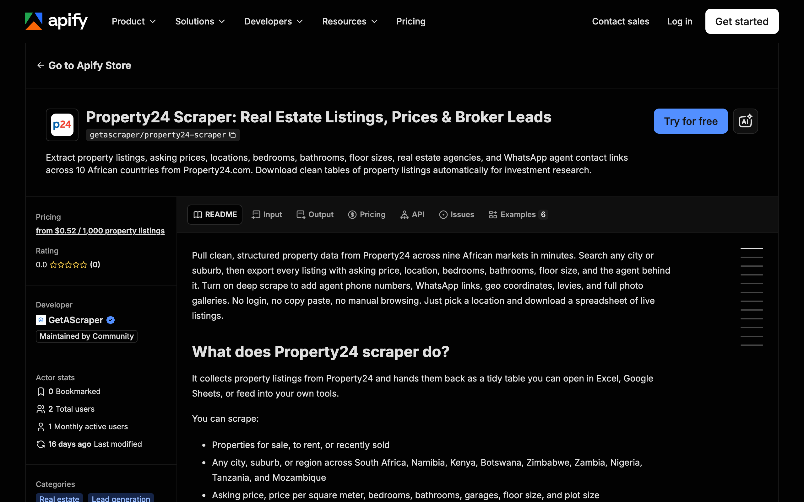

<div align="center">

# Property24 Scraper: Real Estate Listings, Prices & Agent Contacts

[](https://apify.com/getascraper/property24-scraper)
[](https://apify.com/getascraper/property24-scraper)
[](https://apify.com/getascraper/property24-scraper)
[](https://github.com/getascraper/how-to-scrape-property24/issues)
[](https://github.com/getascraper/how-to-scrape-property24/commits/main)

Extract property listings, asking prices, locations, bedrooms, bathrooms, floor sizes, real estate agencies, and WhatsApp agent contact links across 10 African countries from Property24.com. Download clean tables of property listings automatically for investment research.

[](https://apify.com/getascraper/property24-scraper)

</div>

---

## Why use Property24 Scraper

* **Wide market coverage**: Search South Africa, Namibia, Kenya, Botswana, Zimbabwe, Zambia, Nigeria, Tanzania, Mozambique, and more without switching sites.
* **Investment ready fields**: Every row includes asking price, price per square meter, bedrooms, bathrooms, and floor size, so you can compare properties instantly.
* **Agent and agency contacts**: Turn on deep scrape to add the agent name, agency, phone number, and a ready to use WhatsApp link.
* **Flexible entry points**: Search by location name or paste your own Property24 search and listing URLs.
* **Free preview**: The first 50 results of every run are free, so you can test the output before committing to a paid run.

---

## How to use Property24 Scraper

1. Click **Try for free** on the [Property24 Scraper](https://apify.com/getascraper/property24-scraper) page.
2. Type one or more locations in **Search Locations** (for example, Cape Town or Sandton), or paste Property24 URLs in **Start URLs**.
3. Click **Start**: The actor collects every matching listing and writes one flat row per property.
4. **Download your results**: Export as Excel, CSV, JSON, or HTML from the Output tab.

---

## Input

| Field | Type | Required | Description |
| --- | --- | :---: | --- |
| `startUrls` | array of URLs | No | Property24 search, category, or direct listing URLs. Overrides country, listing type, and search locations when provided. |
| `searchLocations` | array of strings | No | One or more places to search, such as Cape Town, Sandton, or Nairobi CBD. The scraper builds the search for you. |
| `country` | enum | No | Which Property24 country site to use when no start URLs are given. Covers African markets including South Africa, Namibia, Kenya, Botswana, Zimbabwe, Zambia, Nigeria, Tanzania, and Mozambique. |
| `listingType` | enum | No | Scrape properties for sale, to rent, or recently sold. |
| `propertyType` | enum | No | Narrow results to houses, apartments, townhouses, vacant land, farms, or commercial. |
| `maxItems` | integer | No | Maximum total property listings to scrape across all searches. |
| `minPrice` | integer | No | Only return listings at or above this price. |
| `maxPrice` | integer | No | Only return listings at or below this price. |
| `bedrooms` | integer | No | Only return listings with at least this many bedrooms. |
| `bathroomsMin` | integer | No | Only return listings with at least this many bathrooms. |
| `minFloorSize` | integer | No | Only return listings at or above this floor size in square meters. Works best with deep scrape on. |
| `sortBy` | enum | No | Order results by relevance, newest, price, or floor size. |
| `deepScrape` | boolean | No | Visit each listing page to add agent contacts, WhatsApp links, coordinates, sizes, levies, rates, and photos. |
| `proxyConfiguration` | object | Yes | Proxy settings. Residential proxies are recommended for South African domains. |

---

## Output

Each row in your dataset is one property listing. All fields are flat with no nested data, so the file opens cleanly in any spreadsheet program.

```json
{
  "listing_id": "117156004",
  "title": "6 Bedroom House in Camps Bay",
  "listing_type": "For Sale",
  "property_type": "House",
  "country": "South Africa",
  "province": "Western Cape",
  "city": "Cape Town",
  "suburb": "Camps Bay",
  "street_address": "Geneva Drive",
  "postal_code": "8005",
  "latitude": -33.9508,
  "longitude": 18.3776,
  "description": "Architectural masterpiece with uninterrupted Atlantic views.",
  "price": 75000000,
  "price_text": "75000000 (ZAR)",
  "price_per_sqm": 125000,
  "bedrooms": 6,
  "bathrooms": 6,
  "garages": 3,
  "parking_spaces": 4,
  "floor_size": 600,
  "erf_size": 850,
  "levies": 0,
  "rates_taxes": 12500,
  "has_solar": "Yes",
  "pet_friendly": "Yes",
  "garden": "Yes",
  "picture_url": "https://images.prop24.com/117156004/Crop600x400",
  "agency_name": "Seeff Atlantic Seaboard",
  "agent_name": "Jane Smith",
  "agent_phone": "+27821234567",
  "whatsapp_link": "https://wa.me/27821234567",
  "listing_url": "https://www.property24.com/for-sale/camps-bay/cape-town/western-cape/11014/117156004",
  "scraped_at": "2026-06-24T18:33:22.000Z"
}
```

In fast list mode, the contact, coordinate, and size fields are left out and only the core listing fields are returned.

### Data table

| Field | Type | Description |
| --- | :---: | --- |
| `listing_id` | string | Unique Property24 listing identifier. |
| `title` | string | Listing headline, such as "3 Bedroom House in Rondebosch". |
| `listing_type` | string | For Sale, To Rent, or Recently Sold. |
| `property_type` | string | House, Apartment, Townhouse, and similar. |
| `country` | string | Country the listing is in. |
| `province` | string | Province or region. |
| `city` | string | City. |
| `suburb` | string | Suburb or neighborhood. |
| `street_address` | string | Street address when published. Deep scrape only. |
| `postal_code` | string | Postal code when published. Deep scrape only. |
| `latitude` | number | Map latitude. Deep scrape only. |
| `longitude` | number | Map longitude. Deep scrape only. |
| `description` | string | Full property description. |
| `price` | number | Asking price as a clean number. |
| `price_text` | string | Price as displayed, with currency. |
| `price_per_sqm` | number | Price divided by floor size. Deep scrape only. |
| `bedrooms` | number | Number of bedrooms. |
| `bathrooms` | number | Number of bathrooms. |
| `garages` | number | Number of garages. Deep scrape only. |
| `parking_spaces` | number | Number of open parking bays. |
| `floor_size` | number | Internal floor area in square meters. Deep scrape only. |
| `erf_size` | number | Plot or land size in square meters. Deep scrape only. |
| `levies` | number | Monthly levy amount. Deep scrape only. |
| `rates_taxes` | number | Monthly municipal rates and taxes. Deep scrape only. |
| `has_solar` | string | Yes or No for solar power. Deep scrape only. |
| `pet_friendly` | string | Yes or No for pet friendly. Deep scrape only. |
| `garden` | string | Yes or No for a garden. Deep scrape only. |
| `picture_url` | string | Main listing photo. |
| `agency_name` | string | Listing agency name. Deep scrape only. |
| `agent_name` | string | Listing agent name. Deep scrape only. |
| `agent_phone` | string | Agent phone number. Deep scrape only. |
| `whatsapp_link` | string | Direct WhatsApp link to the agent. Deep scrape only. |
| `listing_url` | string | Link to the original Property24 listing. |
| `scraped_at` | string | Time the record was collected. |

---

## Pricing

**$0.69 per 1,000 results. The first 50 results of every run are completely free.** No monthly subscriptions and no minimum commits.

There are two pricing events. A **Property listing** event fires for every core listing returned in fast list mode, at $0.00069 per listing (about $0.69 per 1,000). An **Enriched listing** event fires for every listing returned with deep scrape on, also at $0.00069 per listing. You only pay for the records you collect, and empty runs cost nothing.

---

## Quick start

Create a `.env` file from `.env.example`, add your [Apify API token](https://console.apify.com/account/integrations), and run:

```bash
npm install
npm start
```

The script uses the [Apify API client](https://docs.apify.com/api/client/js/) to start the [Property24 Scraper](https://apify.com/getascraper/property24-scraper) actor and fetch results.

---

## Tips and optimization

* **Start with fast list mode**: Get a wide sweep of the market at the lowest cost, then turn on deep scrape only for the listings you want to follow up on.
* **Narrow with price and size filters**: Setting min and max price, bedrooms, and floor size keeps your dataset focused and your bill smaller.
* **Use start URLs for repeat searches**: Paste your own saved Property24 search URL to lock in filters that the location field cannot express.
* **Schedule recurring runs**: Use the Apify scheduler to track new listings in your target suburbs every morning.

---

## Frequently asked questions

**Is scraping Property24 legal?**
Yes, collecting publicly available listing data is generally legal. This actor only reads pages that anyone can view in a browser. You are responsible for how you use the data and for following Property24's terms and your local regulations.

**Which countries does it cover?**
African markets including South Africa, Namibia, Kenya, Botswana, Zimbabwe, Zambia, Nigeria, Tanzania, and Mozambique. Pick one in the country setting or paste a URL from any supported site.

**Do I get agent phone numbers and WhatsApp links?**
Yes, when deep scrape is on. Each detailed record includes the agent name, agency, phone number, and a ready to use WhatsApp link where Property24 publishes them.

**Why do some runs return fewer fields than others?**
Fast list mode returns only the core fields from search pages. To get coordinates, agent contacts, sizes, levies, and photos, turn on deep scrape so the actor visits each listing page.

---

## Support

For bug reports, missing fields, or feature requests, open an issue under the [Issues](https://github.com/getascraper/how-to-scrape-property24/issues) tab or visit the [Property24 Scraper](https://apify.com/getascraper/property24-scraper) page on Apify Store.
